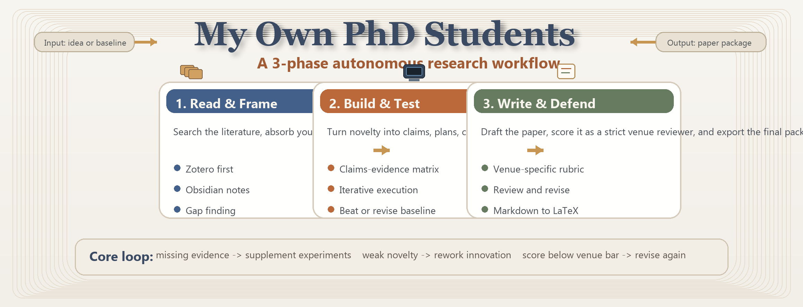

<p align="center">
  
</p>

<h2 align="center"><b>My Own PhD Students</b></h2>
<p align="center"><b>Your private autonomous research workbench.</b></p>

<p align="center">
  
  
  
</p>

<p align="center">
  
</p>

My Own PhD Students is the public-facing name of this autonomous research pipeline. It takes a topic or baseline brief and runs through literature intake, hypothesis generation, experiment planning, code generation, execution, analysis, writing, review, and final export.

The current version is oriented toward practical research iteration rather than demo-only paper generation:

- Venue-aware review loops for targets such as `CCF-A`
- Innovation-to-evidence constraints through a `claims_evidence_matrix`
- Experiment refinement when claims are unsupported or evidence is weak
- Priority literature intake from `Zotero -> Obsidian -> local seed`
- Markdown-first writing with final export to conference-style `LaTeX`
- Reusable learned skills and multi-phase handoff artifacts

## Why This Repo Exists

Most "AI paper generation" projects stop at drafting text. This repo is trying to close the harder loop:

- collect and filter literature
- generate claims that can actually be tested
- design and run experiments against baselines
- audit whether results support the claimed novelty
- rewrite based on review feedback
- export a deliverable paper package

If the results do not beat or justify the baseline, the pipeline is expected to revise claims or rework the experiment path instead of pretending the contribution is valid.

## What You Get

A successful run typically produces:

- `paper_draft.md`: the main manuscript draft
- `paper.tex`: exported LaTeX paper
- `references.bib`: bibliography for cited works
- `deliverables/`: final export bundle
- `stage-09/claims_evidence_matrix.md`: innovation-to-evidence mapping
- `stage-18/review_state.json`: review loop state
- `stage-18/paper_score.json`: score breakdown and target tracking
- `stage-21/learned_skills_summary.md`: run-level learning summary

Important detail: the writing stages are Markdown-first, and LaTeX is generated at the export stage.

## Quick Start

### 1. Install

Windows PowerShell:

```powershell
python -m venv .venv
.\.venv\Scripts\Activate.ps1
pip install -e .
```

Linux/macOS:

```bash
python3 -m venv .venv
source .venv/bin/activate
pip install -e .
```

### 2. Initialize

```powershell
researchclaw setup
researchclaw init
researchclaw doctor --config config.arc.yaml
researchclaw validate --config config.arc.yaml
```

### 3. Run

```powershell
researchclaw run --config config.arc.yaml --topic "Your research idea" --auto-approve
```

Resume the latest run:

```powershell
researchclaw run --config config.arc.yaml --resume
```

## Recommended Configuration Focus

Before your first serious run, check these fields in `config.arc.yaml`:

- `research.topic`
- `research.baseline_brief`
- `research.zotero_library_path`
- `knowledge_base.obsidian_vault`
- `experiment.mode`
- `experiment.sandbox.python_path`
- `quality_assessor.target_venue`
- `prompts.custom_file`

If you are driving the system from an existing baseline paper rather than a vague topic, start by filling out [`baseline_briefing.md`](baseline_briefing.md).

## Literature Intake

The repo now prioritizes curated knowledge sources in this order:

1. `Zotero`
2. `Obsidian`
3. local paper or note seed files

That means your best results usually come from wiring in your real literature library and your actual notes instead of relying only on a loose local seed folder.

## Pipeline Structure

The implementation is organized as a 23-stage pipeline, but operationally it is easier to think of it as 3 macro phases:

1. Research framing
2. Experiment and evidence building
3. Writing, review, and publication packaging

Each phase writes handoff artifacts so later stages can inspect decisions instead of blindly continuing.

## Integrations

Optional integrations already in the repo:

- `Zotero` for literature library ingest
- `Obsidian` for note vault ingest
- `OpenClaw` for external orchestration
- `MetaClaw` for lesson-to-skill carryover across runs

These are optional. The core CLI flow works without them if your local config is valid.

## Documentation

Start here if you want usage docs instead of source browsing:

- [README_USAGE_CN.md](README_USAGE_CN.md): short Chinese usage README
- [docs/USAGE_TUTORIAL_CN.md](docs/USAGE_TUTORIAL_CN.md): detailed Chinese tutorial
- [docs/AUTOMATION_PROCESS_CN.md](docs/AUTOMATION_PROCESS_CN.md): process overview
- [docs/BASELINE_WORKFLOW_CN.md](docs/BASELINE_WORKFLOW_CN.md): baseline-driven workflow

## Repository Layout

Key paths:

- `researchclaw/`: main package
- `researchclaw/pipeline/`: stage orchestration and execution
- `researchclaw/assessor/`: scoring, venue profiles, quality logic
- `researchclaw/skills/`: reusable workflow skills
- `docs/`: user-facing documentation
- `tests/`: regression and integration tests

## Development

Useful commands:

```powershell
researchclaw doctor --config config.arc.yaml
researchclaw validate --config config.arc.yaml
pytest -q
```

If you are contributing to the pipeline, inspect stage outputs under `artifacts/rc-*/` rather than judging a run only by whether a paper file exists.

## License

This project is released under the [MIT License](LICENSE).
